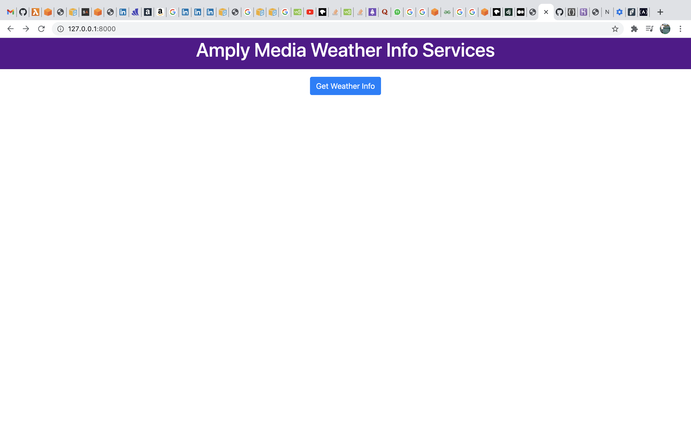
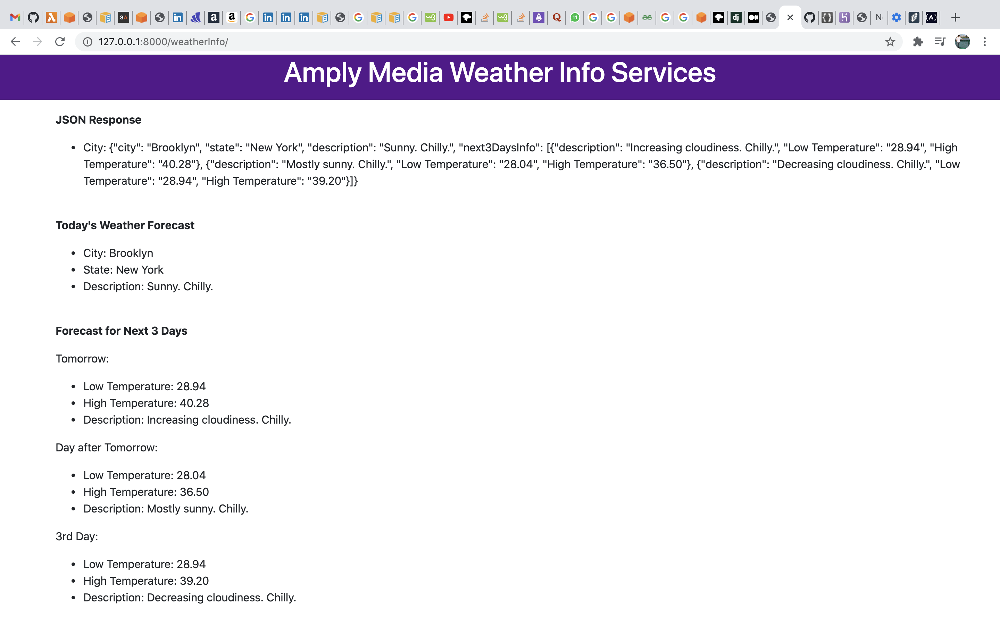
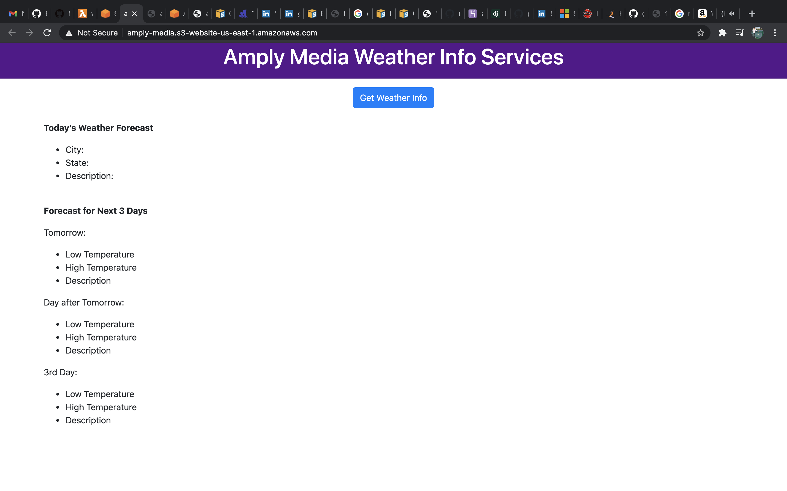
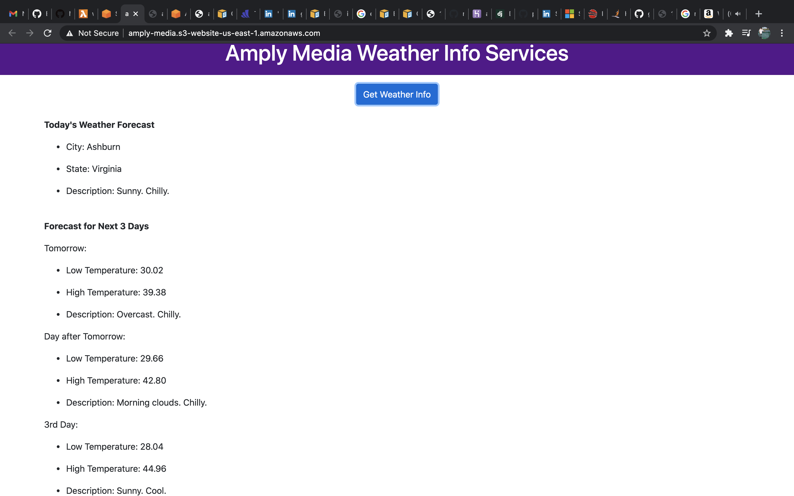

# amply-media-case-study

### Approach 1:

#### Home Page

#### After clicking the button

#### Technology stack: Django, Python, Heroku

1. Django is a Python-based web framework that follows the model-template-views architectural pattern. 
2. Created a virtual environment using the https://github.com/pyenv/pyenv-virtualenv
3. Created amplyMedia Django project
4. Created weatherInfo app inside the project.
    1. In the urls.py file, there are 2 URLS, one which acts as the URL of the home page and another URL which will return the data in a proper required format and display it nicely on the browser.
    2. On the Home page, you will just see the Header "Amply Media Weather Info Services" and a button "Get Weather Info".
    3. When you click on the button, it takes you to the /weatherInfo url which displays the weather forecast for today along with the next 3 days. 
    4. Each of these URLS has an implemented functionality behind it which is described in the views.py file. 
    5. For the home URL, the view just loads the index.html template and has the above mentioned header and button. 
    6. For the weatherInfo/ URL, the view first checks for the cache if the response already exists in the database and if not then calls the third party API and gets the weather details based on the user's existing location. The view parses the response from the third party API and and sends all the data required as a context to the template weatherInfo.html. All of the required data is then displayed in a proper format on the browser. 
    7. Used requests, requests_cache, logging, json libraries to implement the necessary required details. 
 5. I tried to deploy it on Heroku but was facing some issues with it but you can test it locally. 
 6. References -  https://docs.djangoproject.com/
 
#### Steps for running locally - 

1. Create a virtual environment using the link https://github.com/pyenv/pyenv-virtualenv
2. Install all the dependencies which is present in requirements.txt file. You can also do `pip install -r requirements.txt` if you have pip installed already.
3. cd into Approach 1 where the manage.py file is located and run `python manage.py runserver`. It will then start a local development server where you can go to the localhost and see the output on the browser. 

#### Output on terminal - 

##### First Output - 
<Response [200]>
time:  Sat Jan  9 00:08:35 2021
cache:  False
Brooklyn
New York
Clear. Chilly.
desc1:  Afternoon clouds. Chilly. lowTemp1: 28.94 highTemp1: 40.64
desc2:  Scattered clouds. Chilly. lowTemp2: 28.22 highTemp2: 36.86
desc3:  Broken clouds. Chilly. lowTemp3: 29.30 highTemp3: 40.10
{"city": "Brooklyn", "state": "New York", "description": "Clear. Chilly.", "next3DaysInfo": [{"description": "Afternoon clouds. Chilly.", "Low Temperature": "28.94", "High Temperature": "40.64"}, {"description": "Scattered clouds. Chilly.", "Low Temperature": "28.22", "High Temperature": "36.86"}, {"description": "Broken clouds. Chilly.", "Low Temperature": "29.30", "High Temperature": "40.10"}]}
[09/Jan/2021 00:08:35] "GET /weatherInfo/ HTTP/1.1" 200 2535

##### Second Output - 
<Response [200]>
time:  Sat Jan  9 00:08:45 2021
cache:  True
Brooklyn
New York
Clear. Chilly.
desc1:  Afternoon clouds. Chilly. lowTemp1: 28.94 highTemp1: 40.64
desc2:  Scattered clouds. Chilly. lowTemp2: 28.22 highTemp2: 36.86
desc3:  Broken clouds. Chilly. lowTemp3: 29.30 highTemp3: 40.10
{"city": "Brooklyn", "state": "New York", "description": "Clear. Chilly.", "next3DaysInfo": [{"description": "Afternoon clouds. Chilly.", "Low Temperature": "28.94", "High Temperature": "40.64"}, {"description": "Scattered clouds. Chilly.", "Low Temperature": "28.22", "High Temperature": "36.86"}, {"description": "Broken clouds. Chilly.", "Low Temperature": "29.30", "High Temperature": "40.10"}]}
[09/Jan/2021 00:08:45] "GET /weatherInfo/ HTTP/1.1" 200 2535

##### Explaination - 
You can check the cache which is False in the first response because it was not there in the cache and it called the API to get the actual response. In the second output, you can see that the cache: True now as it already has the response in the cache and that's why it retured that response from the cache and didn't call the API. 
   
    
### Approach 2: Live Url - http://amply-media.s3-website-us-east-1.amazonaws.com/

#### Home Page

#### After clicking the button

#### Technology stack: AWS API Gateway, AWS Lambda, AWS S3, Python 

1. Created an API using AWS API Gateway called weatherInfo. On the root resource itself, the API has a GET method which invokes the Lambda function weatherInfo when the API is hit. The API is currently deployed on the dev stage. Here is the URL for it - https://5e7807d91c.execute-api.us-east-1.amazonaws.com/dev
2. The Lambda function contains the necessary implementation for calling the third party API to get the weather details and the response is the then parsed to return the required info in a JSON format. I have also made use of Lambda Layers to make zip and upload the required packages.
3. In order to connect the API and backend to the frontend, I downloaded the zip version of my API and connected the pieces together so that everything can be viewed on the browser. 
4. After that, all of my code is hosted on the AWS S3 by making all the configurations and setting the right policies for the bucket. Here is the URL for it - http://amply-media.s3-website-us-east-1.amazonaws.com/

## Answers to the requirements 

1. Your service should parse out and return city, state, and weather description & high and low temperatures
for the next 3 days only from the provided endpoint
Ans - Yes, it able to achive the above mentioned requirement. 

2. Your service should internally cache results and only make requests to the third party API when a
location has not been previously requested
Ans - We can make use of the requests_cache library to cache the responses from the API. It is explained in the Approach 1 -> Output on terminal section. We can similarly do the same for the second approach or we can also make use of the API cache that the AWS provides. I did not enable API caching for the Approach 2 because it would incur some costs. 

3. Your service should log individual user requests in a format that can be used for data analytics after the
fact. For example, We would like to be able to track how many users from Kansas City requested weather
on this service the past 7 days.
Ans - I have used the logging library to log the required results. We can then collect these logs and then use some monitoring and logging tools and mechanisms to achieve the requirements. We can use ELK(Elasticsearch, LogStach, Kibana), splunk tools for these. We can then perform analytics on it by executing a SQL query like SELECT count(users) FROM logs WHERE location="city"

4. How would you implement your API in an AWS environment to provide a solution that is highly
available, fault tolerant, and scalable?
Ans - We can make of the 2nd approach to execute it on the AWS environement. AWS would be able to handle the availability, scalability and fault tolerance for our infrastructure if we configure everything based on our current requirements and needs. However, I am sure there would be multiple ways to do this on AWS environment and would be happy to know more about it from others. 
